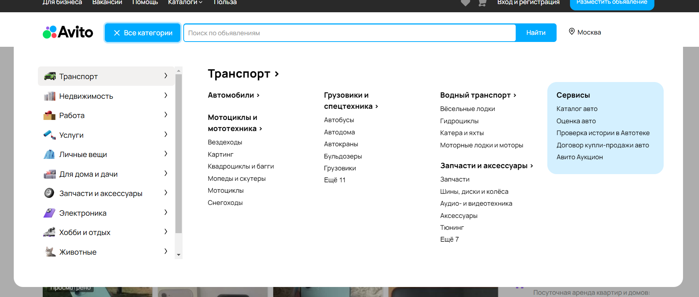

| Идентификатор | Описание                                                                        | Шаги                                                                                                                                                                                                                                                                                                                                                                  |                              Входные данные                              |                                                                                                                                            Ожидаемые результаты                                                                                                                                            |        Фактические результаты       | Статус          |
|---------------|---------------------------------------------------------------------------------|-----------------------------------------------------------------------------------------------------------------------------------------------------------------------------------------------------------------------------------------------------------------------------------------------------------------------------------------------------------------------|:------------------------------------------------------------------------:|:----------------------------------------------------------------------------------------------------------------------------------------------------------------------------------------------------------------------------------------------------------------------------------------------------------:|:-----------------------------------:|-----------------|
| TU1           | Проверка входа пользователя с несуществующими логином и паролем                 | 1.Откройте сайт https://www.avito.ru/ 2.Нажмите кнопку Вход и регистрация 3.Введите логин  4.Введите пароль  5.Нажмите кнопку войти                                                                                                                                                                                                                       | логин = yy22 пароль = sHsEsRs22                                          | Пользователь должен остаться на странице логина. Появится сообщение «Неверные логин или пароль»                                                                                                                                                                                                            | как ожидали(см.рис.1)               | Пройден успешно |
| TU2           | Проверка поиска пользователя по названию                                        | 1.Откройте сайт https://www.avito.ru/ 2.В поле поиска по объявлениям введите текст запрос 3.Нажмите кнопку найти                                                                                                                                                                                                                                                      | Текст запроса поиска = телефон                                           | Пользователь должен перейти на страницу поиска с запросом, введенным в поле поиска. Появятся объявления содержащие внутри себя текст запроса.                                                                                                                                                              | как ожидали(см.рис.2)               | Пройден успешно |
| TU3           | Проверка поиска пользователя по названию и геопозиции                           | 1.Откройте сайт https://www.avito.ru/ 2.В поле поиска по объявлениям введите текст запроса 3.Нажмите кнопку найти 4.Рядом с кнопкой найти, нажмите кнопку "во всех регионах, радиус" 5.В поле город или регион введите текст запроса или выберите из предложенных вариантов 6.Пролистайте страницу вниз, нажмите показать хх тыс. объявлений(xx - вещественное число) | Текст запроса поиска = телефон Текст запроса города или региона = москва | Пользователь должен перейти на страницу поиска с запросом, введенным в поле поиска и поле региона. Появятся объявления содержащие внутри себя текст запроса в определенном регионе или городе.                                                                                                             | как ожидали(см.рис.3)               | пройден успешно |
| TU4           | Проверка перехода на страницу с описанием и характеристикой товара              | 1.Откройте сайт https://www.avito.ru/ 2.В поле поиска по объявлениям введите текст запроса 3.Нажмите кнопку найти 4.Выберите товар 5.Нажмите на него                                                                                                                                                                                                                  | Текст запроса поиска = телефон                                           | Пользователь должен перейти на страницу поиска с запросом, введенным в поле поиска. Появятся объявления содержащие внутри себя текст запроса. Нажать на товар и получить характеристику и описание.                                                                                                        | как ожидали(см.рис.4)               | пройден успешно |
| TU5           | Проверка кнопки "подписаться на продавца" незарегистрированным пользователем    | 1.Откройте сайт https://www.avito.ru/ 2.В поле поиска по объявлениям введите текст запроса 3.Нажмите кнопку найти 4.Выберите товар 5.Нажмите на него 6.Нажмите на кнопку "Подписаться на продавца"                                                                                                                                                                    | Текст запроса поиска = телефон                                           | Пользователь должен перейти на страницу поиска с запросом, введенным в поле поиска. Появятся объявления содержащие внутри себя текст запроса. Нажать на товар и получить характеристику и описание. При нажатии на кнопку она должна остаться с такой же надписью("Подписаться на продавца")               | Ожидания не подтвердились(см.рис.5) | не пройден      |
| TU6           | Проверка возможности подписаться на продавца незарегистрированным пользователем | 1.Откройте сайт https://www.avito.ru/ 2.В поле поиска по объявлениям введите текст запроса 3.Нажмите кнопку найти 4.Выберите товар 5.Нажмите на него 6.Нажмите на кнопку "Подписаться на продавца"                                                                                                                                                                    | Текст запроса поиска = телефон                                           | Пользователь должен перейти на страницу поиска с запросом, введенным в поле поиска. Появятся объявления содержащие внутри себя текст запроса. Нажать на товар и получить характеристику и описание. При нажатии на кнопку незарегистрированным пользователем должно появиться окно регистрации/авторизации | как ожидали(см.рис.6)               | пройден         |
| TU7           | Проверка кнопки "Все категории"                                                 | 1.Откройте сайт https://www.avito.ru/ 2.Нажмите кнопку "Все категории"                                                                                                                                                                                                                                                                                                | Входных данных нет                                                       | Пользователь должен получить выплывающее меню со всеми категориями, которые есть на сайте.                                                                                                                                                                                                                 | как ожидали(см.рис.7)               | пройден         |
| TU8           | Проверка кнопки "Помощь"                                                        | 1.Откройте сайт https://www.avito.ru/ 2.Нажмите кнопку "Помощь"                                                                                                                                                                                                                                                                                                       | Входных данных нет                                                       | Пользователь должен быть перенаправлен на страницу с FAQ.                                                                                                                                                                                                                                                  | как ожидали(см.рис.8)               | пройден         |
| TU9           | Проверка возможности добавить товар в избранное                                 | 1.Откройте сайт https://www.avito.ru/ 2.В поле поиска по объявлениям введите текст запроса 3.Нажмите кнопку найти 4.Выберите товар 5.Нажмите на кнопку в виде сердце справа от названия 6.Нажмите на кнопку в виде сердца в хедере                                                                                                                                    | Текст запроса поиска = телефон                                           | Пользователь должен перейти на страницу поиска с запросом, введенным в поле поиска. Появятся объявления содержащие внутри себя текст запроса. Далее иметь возможность добавить товар в избранное и посмотреть свои избранные товары.                                                                       | как ожидали(см.рис.9)               | пройден         |
| TU10          | Проверка сортировки по цене среди избранных товаров                             | 1.Откройте сайт https://www.avito.ru/ 2.Нажмите кнопку в виде сердца в хедере 3.Нажмите на 2 противоположно направленные стрелки под категорией "Объявления" 4.В зависимости от нужной сортировки по цене перейдите к пункту 5 или 6 5.В категории сортировки нажмите на "cначала дороже" 6.В категории сортировки нажмите на "сначала дешевые"                       | Входных данных нет                                                       | Пользователь должен быть перенаправлен на страницу с избранными товарами после нажатия на сердце. При нажатии на соответствующие кнопки сортировки, товары сортируются.                                                                                                                                    | как ожидали(см.рис.10)              | пройден         |
| TU11          | Проверка кнопки "Доставка"                                                      | 1.Откройте сайт https://www.avito.ru/ 2.Нажмите кнопку "Доставка"                                                                                                                                                                                                                                                                                                     | Входных данных нет                                                       | Пользователь должен быть перенаправлен на страницу с информацией о авито доставке товара.                                                                                                                                                                                                                  | как ожидали(см.рис.11)              | пройден         |
| TU12          | Проверка возможности посмотреть другие объявления продавца                      | 1.Откройте сайт https://www.avito.ru/ 2.В поле поиска по объявлениям введите текст запроса 3.Нажмите кнопку найти 4.Выберите товар 5.Справа от кнопки добавления в избранное нажать на имя продавца                                                                                                                                                                   | Текст запроса поиска = телефон                                           | Пользователь должен перейти на страницу поиска с запросом, введенным в поле поиска. Появятся объявления содержащие внутри себя текст запроса. Далее путем нажатия на продавца, перейти в его магазин.                                                                                                      | как ожидали(см.рис.12)              | пройден         |